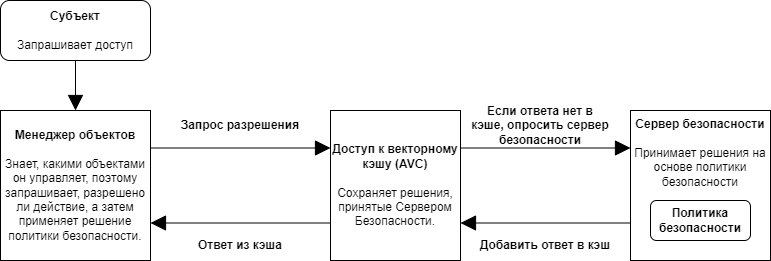
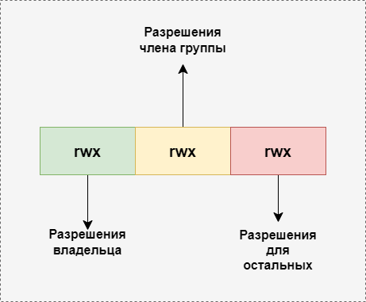

Ниже приведен примерный перевод статьи https://github.blog/2023-07-05-introduction-to-selinux/

---

Наша главная миссия в GitHub Security Lab — помочь защитить программное обеспечение с открытым исходным кодом, на которое мы все полагаемся. Хотя безопасность самих приложений важна, один из лучших способов, которыми разработчики и системные администраторы могут обеспечить безопасность своих систем, — это создание нескольких уровней привилегий. Linux, самая популярная операционная система с открытым исходным кодом, предоставляет для этого множество систем безопасности, в том числе позволяет администратору предоставлять каждой службе и пользователю необходимые разрешения и запрещает им доступ к ресурсам, которых у них нет.

Сегодня я представлю [SELinux](https://selinuxproject.org/), один из многих механизмов безопасности, реализованных в Linux. Несмотря на то, что во многих дистрибутивах Linux модули безопасности Linux включены по умолчанию, общие знания SELinux среди разработчиков и системных администраторов не так распространены, как можно было бы ожидать. Кроме того, теоретические и практические знания о SELinux часто разбросаны по Интернету и часто написаны в блогах или на форумах за прошедшие годы. В этом блоге я надеюсь представить SELinux разработчикам и администраторам, которые ищут практический способ повысить безопасность своих систем, в которых не включен модуль безопасности, и показать тем, кто уже использует модуль, что может предложить SELinux. Я расскажу о различиях между MAC и DAC, объясню основы системы типов SELinux, предложу несколько полезных инструментов и примеров при взаимодействии с SELinux и дам краткое объяснение того, как SELinux работает в ядре.

Один вопрос, который сразу приходит на ум в такой многопользовательской системе, — это право собственности. Пользователь может владеть, например, файлом. После назначения владельца естественным образом возникает следующий вопрос: может ли пользователь взаимодействовать с ресурсами, принадлежащими другому пользователю? Это привело к разработке контроля доступа — стандарта, используемого для определения разрешений в системах. Контроль доступа можно разделить на два основных типа: дискреционный контроль доступа (DAC) и обязательный контроль доступа (MAC). Дискреционный контроль доступа основан на владельцах, где владелец может решать, кто имеет доступ к его ресурсам. DAC используются во всех современных операционных системах. Например, операционные системы POSIX назначают каждому файлу/каталогу владельца, который может решать, как пользователи в его группе и за ее пределами могут взаимодействовать с файлом. Другим примером является Windows, разрешения NTFS немного сложнее, позволяя перекрывать разрешения "разрешения и запрета", но по-прежнему следуют модели, ориентированной на владельца. MAC гораздо менее популярны и основаны на самих ресурсах, их конфиденциальности и уровне доступа, который необходим пользователям для доступа к этому уровню чувствительности. Системы MAC стали более популярными в последние годы, поскольку пользователи стремятся к большей детализации и контролю над безопасностью своей системы. В настоящее время некоторые популярные системы MAC включают [seccomp](https://ru.wikipedia.org/wiki/Seccomp), который используется программным обеспечением для контейнеризации, таким как Docker, и обязательный контроль целостности, который обеспечивает уровни целостности для защиты объектов в Windows. Сегодня мы рассмотрим один из первых MAC, добавленных в ядро ​​Linux, SELinux.

SELinux изначально был проектом разработки Агентства Национальной Безопасности (АНБ) и изначально был реализован как загружаемый модуль ядра для ядра Linux v2.4. АНБ интегрировало SELinux в ядро ​​Linux, используя структуру модулей безопасности Linux (LSM). Многие другие инфраструктуры MAC, такие как apparmor, tomoyo и smack, также используют структуру LSM для подключения к ядру Linux. Список этих платформ можно найти в каталоге `/security` дерева исходного кода ядра. Хотя существует множество платформ MAC, на сегодняшний день наиболее популярными являются AppArmor, включенный по умолчанию в последних версиях Ubuntu, и SELinux, включенный по умолчанию в Android 5.0+ и Red Hat/Fedora. Чтобы лучше понять SELinux и способы реализации политики безопасности, я сначала представлю базовую архитектуру SELinux.

## Архитектура SELinux — основы

Архитектуру SELinux можно разделить на четыре основных компонента.

1. Во-первых, Субъект должен запросить доступ, чтобы выполнить действие. В большинстве случаев субъектом является процесс, запрашивающий доступ к ресурсу. Доступ можно контролировать с помощью правил вектора доступа (AVR), подробности которых будут представлены в ближайшее время.
2. Во-вторых, диспетчер объектов (ОМ), который контролирует доступ субъекта. Он отправит запрос серверу безопасности, чтобы разрешить или запретить действия.
3. Сервер безопасности — сервер безопасности принимает решения на основе Политики безопасности и возвращает ответ.
4. Access Vector Cache (AVC) — это кэш, в котором хранятся решения сервера безопасности с целью повышения производительности.

В документации SELinux представлена ​​краткая диаграмма, показывающая взаимодействие между этими четырьмя компонентами.



> источник: https://github.com/SELinuxProject/selinux-notebook/raw/main/src/images/1-core.png

Сервер безопасности может быть только один, расположенный в ядре. Однако AVC и OM могут находиться как в ядре, так и в пользовательском пространстве. В пространстве ядра платформа модулей безопасности Linux представляет собой OM, поскольку она решает, какие службы ядра могут быть ограничены структурой безопасности, такой как SELinux. AVC обычно реализуются как хеш-карта, используемая для кэширования решений в реализациях ядра или пользовательской области. В пространстве пользователя одно приложение может быть как OM, так и AVC для ресурсов, которыми оно управляет. Это возможно с помощью API SELinux для запроса сервера безопасности.

## Базовое понимание контекста

В системе DAC UNIX разрешения представлены в следующем формате:



> источник: https://www.javacodemonk.com/explain-unix-file-permissions-cac6d25f

Здесь `rwx` означает чтение, запись и выполнение соответственно. В каждом поле показаны разрешения для владельца, члена группы и лица, не являющегося членом группы, соответственно. Владелец файла имеет возможность изменять права доступа к файлам, которыми он владеет. Мы можем использовать команду `ls` с флагом L в нижнем регистре, чтобы увидеть разрешения файла Unix.

```bash
policy> ls -l example

-rw-r--r-- 1 kevin staff 0 Apr 30 22:29 example
```

`ls` показывает разрешения, количество жестких ссылок, владельца (kevin), группу (staff), размер (0), дату и имя файла.

Напротив, SELinux MAC назначает контекст безопасности каждому субъекту или объекту, где субъекты можно рассматривать как процессы, а объекты — это ресурсы, предоставляемые операционной системой или программой пользовательского пространства. Мы можем использовать команду `ls` с флагом Z, чтобы увидеть контекст SELinux файла Unix.

```bash
policy> ls -Z /etc/passwd

system_u:object_r:passwd_file_t:s0 /etc/passwd
```

Формат контекста безопасности выглядит следующим образом: user:role:type:[:range]

где:

### User

Пользователь представляет пользователя SELinux. Пользователь SELinux отделен от пользователя Linux, но может быть назначен нескольким пользователям Linux и помогает преодолеть разрыв между миром Linux и миром SELinux. Имена пользователей SELinux часто заканчиваются на `_u`.

### Role

Роль представляет роль, в которой должен находиться пользователь. Роль может иметь более одного пользователя SELinux, и они по соглашению заканчиваются на `_r`. Роли часто представляют собой работу пользователя Linux, например администратор, обычный пользователь, администратор базы данных и т. д.

### Type

Типы являются наиболее важной частью контекста, поскольку все правила основаны на типах, и поэтому тип субъекта, домена или объекта определяет его разрешения. Когда тип связан с процессом, он определяет, к каким процессам (или доменам) может получить доступ пользователь SELinux (субъект). Когда тип связан с объектом, он определяет, какие права доступа имеет пользователь SELinux к этому объекту. SELinux и соблюдение типов идут рука об руку. Пользователи, присутствующие в привилегированных доменах SELinux, обычно помеченных как `unconfined` (неограниченные), часто могут указывать файлы политики SELinux, файлы *.te, чтобы создать определенные разрешения для типа/домена. Более подробную информацию об этом можно найти в разделе «Политика безопасности».

### Range

Поле диапазона контекста — это расширенный параметр, который назначает диапазон чувствительности. Они представлены в формате `s#`, где `#` — номер. По соглашению низшие имеют меньшие привилегии, чем высшие. Чувствительности могут читать и записывать на свой собственный уровень чувствительности, но могут читать только с более низких и записывать только на более высокие. Вы можете определить одну чувствительность, чтобы она доминировала над другой, используя оператор доминирования в политике SELinux. Например, доминирование `{s1, s2}` означает, что s2 доминирует над s1. Когда диапазон определяется только чувствительностью, это называется многоуровневой безопасностью (MLS). В дополнение к MLS существует Multi-Category Security, где для расчета доступа используется комбинация чувствительности и категорий. MCS вводит идею категорий, которые представляют собой отсеки, внутри которых применяется чувствительность. В отличие от чувствительных, в категориях нет иерархии, но они используются для определения разных типов ресурсов. Например, финансовые документы могут относиться к работе, побочному бизнесу и личным инвестициям. Процесс может получить доступ только к объектам, которые находятся в тех же категориях, что и он сам. В целом диапазон может выглядеть как `s1-s15:c0.c700`, что означает, что процесс имеет эффективную чувствительность s1 и чувствительность (максимальную) чувствительности. из 15 с возможностью доступа к контейнерам от 0 до 700. Следовательно, учитывая объект в `s0:c0`, указанный выше процесс может только читать его, поскольку он имеет более низкий уровень чувствительности и находится в том же контейнере.

Теперь, когда мы понимаем, как работают метки SELinux, мы можем использовать некоторые инструменты, чтобы узнать больше о SELinux. Я буду использовать дистрибутив Fedora, в котором SELinux включен по умолчанию.

Обратите внимание, что в некоторых дистрибутивах Linux включены разные системы MAC, и одновременный запуск нескольких эксклюзивных LSM может вызвать проблемы. Например, в Ubuntu по умолчанию включен AppArmor, поэтому включение SELinux при включенном AppArmor не позволит вам правильно загрузиться. Пожалуйста, проверьте `include/linux/lsm_hooks.h` на наличие `LSM_FLAG_EXCLUSIVE`, чтобы узнать, является ли ваш LSM эксклюзивным.

Во-первых, мы можем получить список пользователей, используя флаг `-u`:
(`seinfo` входит в пакет `setools-console`)

```bash
[root@test-server ~]# seinfo -u

Users: 8
   guest_u
   root
   staff_u
   sysadm_u
   system_u
   unconfined_u
   user_u
   xguest_u

```

Мы можем запустить `semanage login -l`, чтобы получить сопоставления пользователя Linux с пользователем SELinux.

```bash
[root@test-server ~]# semanage login -l

Имя входа            Пользователь SELinux Диапазон MLS/MCS     Служба

__default__          unconfined_u         s0-s0:c0.c1023       *
alice                user_u               s0                   *
bob                  user_u               s0                   *
root                 unconfined_u         s0-s0:c0.c1023       *

```

Здесь мы видим, что пользователь root находится под пользователем `unconfined_u` SELinux. Здесь `__default__` означает любого пользователя, который явно не определен в файле конфигурации, поэтому любые вновь созданные пользователи Linux являются частью `unconfined_u`. В этом примере я вручную сопоставил пользователей Linux alice и bob с пользователем SELinux `user_u`.

Вы также можете просмотреть сопоставления без специального инструмента, прочитав файл `/etc/selinux/{SELINUXTYPE}/seusers`, но изменения в этом файле не будут применяться непосредственно к политике SELinux и будут перезаписаны.

Аналогичным образом текущий диапазон чувствительности можно просмотреть с помощью файла `/etc/selinux/{SELINUXTYPE}/setrans.conf`.

```bash
[root@test-server ~]# cat /etc/selinux/targeted/setrans.conf
#
# Multi-Category Security translation table for SELinux
#
# Uncomment the following to disable translation libary
# disable=1
#
# Objects can be categorized with 0-1023 categories defined by the admin.
# Objects can be in more than one category at a time.
# Categories are stored in the system as c0-c1023.  Users can use this
# table to translate the categories into a more meaningful output.
# Examples:
# s0:c0=CompanyConfidential
# s0:c1=PatientRecord
# s0:c2=Unclassified
# s0:c3=TopSecret
# s0:c1,c3=CompanyConfidentialRedHat
s0=SystemLow
s0-s0:c0.c1023=SystemLow-SystemHigh
s0:c0.c1023=SystemHigh

```

Глядя на конфигурацию Fedora, мы видим, что в Fedora для всех субъектов/объектов используется только чувствительность s0 и что Fedora поддерживает категории от 0 до 1023.

## Политика безопасности

Политика SELinux — это группа источников политик, которые определяют многие компоненты, с которыми мы познакомились, например имена, роли, типы и т. д. Однако политики SELinux обычно не создаются с нуля. Вместо этого вы можете использовать базовую политику, называемую эталонной политикой, которая предоставляет классы и правила, использующие основные компоненты Linux. Эталонная политика была разработана АНБ, поддерживалась Tresys и теперь находится в организации GitHub [SELinuxProject](https://github.com/SELinuxProject/refpolicy).

В дополнение к эталонной политике каждый отдельный поставщик может редактировать политику для поддержки своих собственных услуг и повышения безопасности. Чтобы лучше понять, как выглядит политика SELinux, мы проанализируем эталонную политику, чтобы понять базовую структуру политики и то, что можно изменить. Чтобы продолжить, вы можете клонировать репозиторий, расположенный здесь: https://github.com/SELinuxProject/refpolicy.

При открытии политики SELinux может появиться несколько типов файлов, и полезно знать их имена и назначение. Наиболее распространенными типами файлов, которые вы встретите, являются файлы `.te` и `.if`, которые составляют основу политики SELinux. Файлы `.te` — это файлы принудительного применения типов, и они составляют основное ядро ​​логики политик. В этом файле вы можете писать разрешающие правила, объявлять типы или определения типов и вызывать макросы, определенные файлами `.m4`. Просматривая политики SELinux, вы встретите такие макросы, как `gen_context`, название которых обычно полностью объясняет их назначение. Эти макросы определены в файлах `.m4`, присутствующих в политике. Далее, `.if` — это сокращение от файлов интерфейса, которые представляют собой макросы, но, как следует из названия, действуют как интерфейсы к доменам, представленным в текущем модуле. Наконец, вы увидите файлы контекста файла `.fc`, которые определяют список путей и контекстов, назначенных этому пути. В последнем разделе мы использовали `ls -Z` для просмотра контекста `/etc/passwd`, но мы также можем увидеть его определение в `authlogin.fc`:

```
/etc/passwd[-\+]? – gen_context(system_u:object_r:passwd_file_t, s0)
```

Открыв [репозиторий](https://github.com/SELinuxProject/refpolicy), мы можем перейти к папке политики, в которой находятся политики, которые мы ищем. Здесь мы видим папки `flask`, `modules` и `support`. Глядя на папку `flask`, имя которой представляет собой первую итерацию SELinux с именем Flux Advanced Security Kernel, мы видим файл с именем `Initial_sids`. Здесь мы можем видеть идентификаторы SID, которые генерируются при загрузке, чтобы правильно идентифицировать множество различных служб. SID — это целое число, которое используется для идентификации контекста безопасности и используется внутри ядра в качестве идентификатора. Чтобы увидеть, какие SID каким контекстам соответствуют, мы можем проверить [определения модулей](https://github.com/SELinuxProject/refpolicy/blob/ad527f9f62573bf43b185400b15804af7d0a8c14/policy/modules/kernel/kernel.te#L51) и найти запись, соответствующую формату:

sid name context

Например, в ядре sid есть следующая запись:

```
sid kernel gen_context(system_u:system_r:kernel_t,mls_systemhigh)
```

Здесь мы видим, что объектам, созданным ядром, таким как потоки и сокеты, будет присвоен sid ядра, то есть их контекст. Если мы посмотрим на базу данных на [сервере безопасности](https://elixir.bootlin.com/linux/v6.4/source/security/selinux/ss/policydb.h#L174), мы увидим, что структура контекста содержит некоторые из этих начальных идентификаторов, включая их имя, соответствующую информацию, контекст и номер идентификатора. Как правило, исходные идентификаторы не изменяются, поскольку они требуют изменений в ядре Linux. На [sidtab](https://elixir.bootlin.com/linux/v6.4/source/security/selinux/ss/sidtab.c) сервера безопасности мы видим, как ядро ​​может транслировать sid в контекст. Короче говоря, контекст для неначальных sid находится в `sidtab`, который содержит дерево указателей, называемых корнями. Сервер безопасности использует sid для получения правильного уровня и конечного узла в `sidtab->roots`, затем использует sid для индексации указателя и поиска `sidtab_entry` с правильным контекстом для данного sid. Аналогично, элемент isid в sidtab содержит массив начальных идентификаторов SID. Далее давайте посмотрим на файл [`acess_vectors`](https://github.com/SELinuxProject/refpolicy/blob/ad527f9f62573bf43b185400b15804af7d0a8c14/policy/flask/access_vectors), где вы видите структуры следующего [формата](https://github.com/SELinuxProject/refpolicy/blob/ad527f9f62573bf43b185400b15804af7d0a8c14/policy/flask/access_vectors#L4):

```
common name {permission}
```

Мы также можем увидеть записи формата:

```
class class_name
inherits common_name{
extra permission 1
…
}
```

Здесь мы видим, что определенные классы представляют собой общие объекты ядра, такие как файлы, каталоги, сокеты и т. д. Если это разрешено конфигурацией, типам могут быть предоставлены разрешения на доступ к классам другого типа. Давайте возьмем простой пример,

```
allow init_t user_home_t:file read;
```

Это означает, что субъектам типа `init_t` разрешено читать файлы типа `user_home_t`. Это называется правилом `allow`, которое является частью более широкого набора правил, называемого правилами вектора доступа (AVR). Правило `allow` составляет большую часть и ядро ​​любой политики SELinux, в то время как правила `dontaudit` и `auditallow` определяют, где происходит аудит, и, наконец, правило `neverallow` никогда не разрешает аннулировать любые предыдущие и будущие разрешения.

Заглянув в папку модулей, мы видим, что политика разделена на разные категории, такие как [admin](https://github.com/SELinuxProject/refpolicy/tree/ad527f9f62573bf43b185400b15804af7d0a8c14/policy/modules/admin), [apps](https://github.com/SELinuxProject/refpolicy/tree/ad527f9f62573bf43b185400b15804af7d0a8c14/policy/modules/apps), [kernel](https://github.com/SELinuxProject/refpolicy/tree/ad527f9f62573bf43b185400b15804af7d0a8c14/policy/modules/kernel) ​​и т. д. Эти категории далее разделены на модуль (который состоит из .te (type enforcement), .fc (interface file) и файлы .if (file context), причем каждый файл принудительного типа начинается с макроса [`policy_module`](https://github.com/SELinuxProject/refpolicy/blob/ad527f9f62573bf43b185400b15804af7d0a8c14/doc/example.te#L2). Каждый модуль компилируется в файл `.pp`, который можно загрузить в операционную систему.

Если вы хотите узнать больше о внутреннем устройстве SELinux, я бы рекомендовал ознакомиться с содержимым папки модулей для конкретного варианта политики, которую использует ваше программное обеспечение. Он может помочь вам понять определения многих распространенных макросов и может стать хорошим справочником, если вы столкнетесь с какими-либо проблемами с разрешениями SELinux при взаимодействии с системой Linux и ее собственными службами.

## Как выглядит отказ в журналах SELinux

Для администратора или пользователя системы с включенным SELinux обычным явлением будут проблемы с разрешениями SELinux, особенно при установке нового программного обеспечения. К счастью, в SELinux есть множество инструментов, позволяющих диагностировать и устранить проблему. Во-первых, я хотел бы представить, как выглядит запись в журнале об отказе в доступе и где найти журналы об отказе в доступе.

```
type=AVC msg=audit(1680661610.629:836): avc: denied { append } for pid=774
comm=72733A6D61696E20513A526567 name="messages" dev="sda3" ino=255765 scontext=system_u:system_r:syslogd_t:s0 tcontext=unconfined_u:object_r:named_conf_t:s0 tclass=file permissive=0
```

Это пример отказа AVC с соответствующим контекстом субъекта, целевым контекстом, классом, разрешениями и типом. Журналы SELinux можно найти в каталоге `/var/log/audit` или `/var/log/audit/audit.log` или с помощью некоторых вспомогательных двоичных файлов, таких как `sealert`. Важно отметить, что существует инструмент под названием [`ausearch`](https://man7.org/linux/man-pages/man8/ausearch.8.html), который позволяет фильтровать этот журнал по множеству полей, о которых я упоминал выше. Например, если я просто хочу увидеть AVC (отказы), мы можем запустить `ausearch -m AVC`, чтобы вывести их все.

После обнаружения нашего отказа нам сначала нужно оценить, должен ли субъект иметь доступ к цели, к которой ему было отказано. Мы можем написать несколько правил вручную, чтобы связать эти два правила вместе и решить проблему, или мы можем использовать такие инструменты, как `audit2allow`, приложение, которое получает журнал отказов и предлагает добавить новые правила, чтобы решить нашу проблему. Чтобы добавить наши новые правила в текущую политику SELinux, мы можем создать новый модуль и установить его в текущую систему; политики являются модульными и могут обновляться на работающих машинах. Сначала создайте файл `.te`, содержащий все новые правила, которые вы хотите применить к политике. Убедитесь, что в вашем типовом файле есть макрос `policy_module(name, version)`, чтобы правильно назвать ваш модуль, и убедитесь, что имена ваших файлов соответствуют имени вашего модуля. Затем возьмите `Makefile` из `/usr/share/selinux/devel/Makefile`, который мы будем использовать для компиляции файлов, и запустите

```bash
make module_name.pp
```

в результате в рабочем каталоге, который является нашим модулем, должен появиться файл `module_name.pp`. Наконец, загрузите этот модуль на свой компьютер, используя `semodule -i module_name.pp`.

Используя `seinfo`, мы можем просмотреть вновь созданные типы и правила:

```bash
[root@test-server ~]# seinfo -t | grep kevit_t
   kevin_t
```

```bash
[root@test-server ~]# sesearch --allow | grep "kevit_t kevit_t"
allow kevin_t kevin_t:association sendto;
```

## Внутреннее устройство LSM (Linux Security Module)

Чтобы понять, как SELinux может управлять службами на уровне ядра, мы должны понять структуру модулей безопасности Linux (LSM), которая является строительным блоком для многих MAC-систем. Я представлю некоторые соответствующие структуры ядра платформы LSM, чтобы лучше понять эту структуру. Во-первых, мы можем увидеть список перехватчиков LSM, присутствующих в файле [`security/security.c`](https://elixir.bootlin.com/linux/v6.4/source/security/security.c), имена которых представляют действие и структуру, которые они используют для перехвата. В качестве примера мы можем взять хук [`security_socket_create`](https://elixir.bootlin.com/linux/v6.2.10/source/security/security.c#L2266):

```
int security_socket_create(int family, int type, int protocol, int kern)
{

    return call_int_hook(socket_create, 0, family, type, protocol, kern);

}
```

Нажав на любую из этих функций, мы увидим, как LSM подключит сервис. В случае `security_socket_create`:

```
int __sock_create(struct net *net, int family, int type, int protocol,
struct socket **res, int kern)
{
    int err;
    struct socket *sock;
    const struct net_proto_family *pf;

    /*
    * Check protocol is in range
    */
    if (family < 0 || family >= NPROTO)
        return -EAFNOSUPPORT;
    if (type < 0 || type >= SOCK_MAX)
        return -EINVAL;

    /* Compatibility.

    This uglymoron is moved from INET layer to here to avoid
    deadlock in module load.
    */
    if (family == PF_INET && type == SOCK_PACKET) {
        pr_info_once("%s uses obsolete (PF_INET,SOCK_PACKET)\n", current->comm);
    family = PF_PACKET;
    }

    err = security_socket_create(family, type, protocol, kern);
    if (err)
         return err;
…
```

перехватывает внутреннюю функцию `__sock_create` в сетевой подсистеме. Эти функции `security_xxxx` реализованы во многих системных вызовах, драйверах и службах для запроса сервера безопасности SELinux перед выполнением каких-либо привилегированных действий. Функции `security_xxx` являются оболочками реальных перехватчиков LSM, которые используют функцию `call_hook` для доступа к перехватчику. Перехватчики LSM должны быть инициализированы модулем безопасности, который хочет их использовать, иначе они вернут значение по умолчанию. Если мы посмотрим на модуль SELinux, мы увидим, что каждый из `LSM_hooks`, инициализируемый SELinux, использует макрос `LSM_HOOK_INIT`.

```
static struct security_hook_list selinux_hooks[] __lsm_ro_after_init = {
LSM_HOOK_INIT(binder_set_context_mgr, selinux_binder_set_context_mgr),
LSM_HOOK_INIT(binder_transaction, selinux_binder_transaction),
LSM_HOOK_INIT(binder_transfer_binder, selinux_binder_transfer_binder),
LSM_HOOK_INIT(binder_transfer_file, selinux_binder_transfer_file),
…
```

который создает список `security_hook_list`, голова которого помещается в

```
/*
* Initializing a security_hook_list structure takes
* up a lot of space in a source file. This macro takes
* care of the common case and reduces the amount of
* text involved.
*/
#define LSM_HOOK_INIT(HEAD, HOOK) \
{ .head = &amp;security_hook_heads.HEAD, .hook = { .HEAD = HOOK } }

/* `security_hook_heads`, an external variable used by the previous security_xxxx functions. */

struct security_hook_heads {
    #define LSM_HOOK(RET, DEFAULT, NAME, ...) struct hlist_head NAME;
    #include "lsm_hook_defs.h"
    #undef LSM_HOOK
} __randomize_layout;
```

Заглянув в каталог SELinux, мы видим, что функция `selinux_socket_create` соответствует функции LSM-перехватчика `socket_create`, и поэтому мы можем посмотреть `selinux_socket_create`, чтобы увидеть, что она будет делать.

```
static int selinux_socket_create(int family, int type,
int protocol, int kern)
{
    const struct task_security_struct *tsec = selinux_cred(current_cred());
    u32 newsid;
    u16 secclass;
    int rc;

    if (kern)
         return 0;

    secclass = socket_type_to_security_class(family, type, protocol);
    rc = socket_sockcreate_sid(tsec, secclass, &newsid);
    if (rc)
        return rc;

    return avc_has_perm(&selinux_state,
    tsec->sid, newsid, secclass, SOCKET__CREATE, NULL);
}
```

Здесь мы видим, что функция получит SELinux sid (newsid) для соответствующего типа сокета и sid (tsec->sid) для текущего пользователя, а затем запросит AVC (путем вызова `avc_has_perm`), чтобы узнать, является ли этот субъект (процесс) может создать этот новый объект (socket). Хотя некоторые объекты могут иметь единственный тип, SELinux может потребоваться взаимодействовать с уже существующим объектом, тип которого меняется по усмотрению пользователя. Здесь LSM ввел поле `*_security` во многие критические объекты ядра в форме указателя `void`, чтобы модули могли использовать их по своему усмотрению. Хотя сокеты, возможно, и не представляют собой интересную структуру, файлы — это структуры, тип которых может меняться. Поэтому давайте посмотрим, как функции `_security` используются SELinux. Сначала я представлю `selinux_inode`, который возвращает данные, хранящиеся в структуре индексного дескриптора, с использованием поля `i_security`.

```
static inline struct inode_security_struct *selinux_inode(
const struct inode *inode)
{
    if (unlikely(!inode->i_security))
         return NULL;
    return inode->i_security + selinux_blob_sizes.lbs_inode;
}
```

Если мы посмотрим на перехватчики в SELinux, то увидим, что существует функция [`may_create`](https://elixir.bootlin.com/linux/v6.2.10/source/security/selinux/hooks.c#L1759), вспомогательная функция, которая проверяет, может ли файл быть создан определенным пользователем в определенном каталоге.

```
/* Check whether a task can create a file. */
static int may_create(struct inode *dir, struct dentry *dentry, u16 tclass)
{
    const struct task_security_struct *tsec = selinux_cred(current_cred());
    struct inode_security_struct *dsec;
    struct superblock_security_struct *sbsec;
    u32 sid, newsid;
    struct common_audit_data ad;
    int rc;

    dsec = inode_security(dir);
    sbsec = selinux_superblock(dir->i_sb);

    sid = tsec->sid;

    ad.type = LSM_AUDIT_DATA_DENTRY;
    ad.u.dentry = dentry;

    rc = avc_has_perm(&selinux_state,
    sid, dsec->sid, SECCLASS_DIR,
    DIR__ADD_NAME | DIR__SEARCH,
    &ad);
    if (rc)
        return rc;

    rc = selinux_determine_inode_label(tsec, dir, &dentry->d_name, tclass,
    &newsid);
    if (rc)
         return rc;

    rc = avc_has_perm(&selinux_state,
    sid, newsid, tclass, FILE__CREATE, &ad);
    if (rc)
        return rc;

    return avc_has_perm(&selinux_state, newsid, sbsec->sid, SECCLASS_FILESYSTEM, FILESYSTEM__ASSOCIATE, &ad);
}
```

Здесь мы видим функцию `inode_security`, обертку функции `selinux_inode`, которая проверяет индексный дескриптор, соответствующий каталогу, на предмет его атрибутов безопасности, где она захватывает sid каталога для сравнения с текущей задачей, чтобы увидеть, возможно ли создание файла в каталоге.

## SELinux на практике

Хотя понимание того, как работает SELinux, полезно знать, если вас интересует внутреннее устройство ОС, давайте посмотрим, как SELinux реализуется в приложениях. Сначала мы рассмотрим широко используемый инструмент паролей Linux, чтобы ознакомиться с API и понять, как программы пользовательского пространства могут запрашивать ядро. После этого я предложу читателю упражнение, которое поможет лучше понять AVC и менеджеры объектов пользовательской среды.

Основой пользовательского пространства SELinux является `libselinux`, библиотека, предоставляющая стандартный API для взаимодействия со всеми вещами SELinux, включая (но не ограничиваясь этим) запрос политики SELinux, реализацию кэша AVC, настройку обратных вызовов при изменении состояния SELinux и получение дополнительной информации о системе SELinux в целом.

`passwd` — простая утилита, меняющая пароль для определенной учетной записи. Обычно пользователь может изменить только свой пароль, а root может изменить все пароли.

```
int check_selinux_permit (const char *perm_name)
{
    char *user_context_raw;
    int r;

    if (0 == is_selinux_enabled ()) {
         return 0;
    }

selinux_set_callback (SELINUX_CB_LOG, (union selinux_callback) { .func_log = selinux_log_cb });

if (getprevcon_raw (&user_context_raw) != 0) {
    fprintf (shadow_logfd,
    _("%s: can not get previous SELinux process context: %s\n"),
    shadow_progname, strerror (errno));
    SYSLOG ((LOG_WARN,
    "can not get previous SELinux process context: %s",
    strerror (errno)));
    return (security_getenforce () != 0);
}

    r = selinux_check_access (user_context_raw, user_context_raw, "passwd", perm_name, NULL);
    freecon (user_context_raw);
    return r;
}
```

Здесь мы видим, что SELinux проверяет, имеет ли текущий контекст процесса разрешение `passwd` в классе `passwd`, что, по сути, позволяет процессу изменить пароль другого пользователя. Если мы посмотрим (через `ls -Z`) `/usr/bin/passwd`, то увидим, что он имеет тип `passwd_t`. Когда пользователь выполняет `/usr/bin/passwd`, происходит переход домена (если это разрешено политикой SELinux), который позволяет пользователю запускать процессы, которые выполняются в других доменах. В этом примере только пользователь root проверяется на наличие разрешений SELinux. Таким образом, простой способ запретить пользователю root запускать `passwd` для смены паролей предотвратит переход домена, и, таким образом, `/usr/bin/passwd` будет работать как другой тип без правильных разрешений.

Хотя `passwd` — это приложение, поддерживающее SELinux, это относительно простое приложение, которое не предоставляет столько функций SELinux. Существует не так много приложений, которые создают собственный кэш AVC и диспетчер объектов; Двумя наиболее популярными из них являются `Dbus`, который ограничивает процессы, которые могут отправлять сообщения в свои службы, и `sepgsql`, расширение Postgresql с более новой и гораздо более детальной реализацией.

## Упражнение для читателя

Чтобы увидеть параллели между пользовательской областью и AVC ядра, я бы рекомендовал просмотреть [`папку sepgsql`](https://github.com/postgres/postgres/tree/master/contrib/sepgsql) в [`репозитории postgres`](https://github.com/postgres/postgres), чтобы проанализировать проект с пользовательской областью AVC и детальным контролем ресурсов. Я бы порекомендовал взглянуть на документацию postgres, если вы ищете общий обзор баз данных, пользователей и других ресурсов, содержащихся в SELinux. Я добавил два документа, которые, по моему мнению, предоставляют отличный ресурс для лучшего понимания кода `sepqsql`.

1. https://github.com/SELinuxProject/selinux-notebook/blob/main/src/postgresql.md
2. https://wiki.postgresql.org/wiki/SEPostgreSQL_Introduction

## Заключение

В этом блоге я представил каждый из основных компонентов SELinux, чтобы помочь новым пользователям понять общую картину. SELinux может защитить и изолировать компоненты вашей системы, и моя цель — помочь вам решить, подходит ли вам использование SELinux. Я надеюсь, что теперь, просматривая обзор, вы имеете четкое представление о политиках SELinux и их реализации как в пользовательском пространстве, так и в пространстве ядра, а также способны находить и понимать простые журналы SELinux. Примеры и ресурсы, представленные в этом сообщении блога, должны помочь вам начать больше изучать SELinux в вашей собственной системе.

---

Полезные ссылки по теме:

* https://habr.com/ru/companies/kingservers/articles/209644/
* https://lwn.net/Articles/804906/
* https://github.com/SELinuxProject/selinux-notebook
